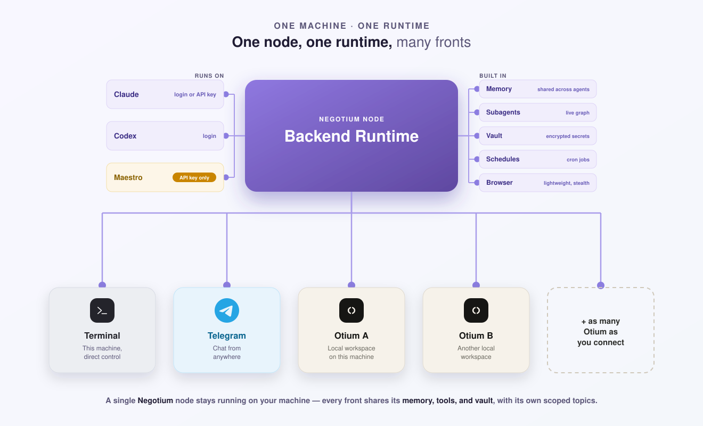

<div align="center">
  <h1>Negotium</h1>
  <p><strong>One machine, one Negotium runtime — reachable from Terminal, Telegram, and multiple Otium workspaces at once.</strong></p>
  <p>Run Claude, Codex, or Maestro with local tools, memory, and schedules.</p>
  <p>
    <a href="./LICENSE"></a>
    
    
    
  </p>
</div>



> *Negotium* is Latin for “work” — literally *nec otium*, the absence of
> leisure. Your machines do the negotium so you can keep the otium.

Negotium turns one computer into one durable backend runtime, not a runtime
that belongs to a single surface. Terminal, Telegram, and any number of Otium
workspaces (local or remote) can all reach it. What's actually shared across
all of them is the runtime layer: memory, wiki, skills, the vault, tool
availability, and Cron. What's *not* shared is scoped on purpose: a topic
belongs permanently to one surface (`terminal` | `telegram` | `otium`) chosen
when it's created, and an Otium-surface topic further belongs to the one
workspace it was created in — so two different Otium workspaces joined to the
same node see different rooms, never each other's. Connecting another Otium
workspace doesn't fork the node or copy its state; it just adds one more
workspace-scoped view over the same underlying vault, memory, and tools.

Otium is a workspace that can be pointed at this runtime; Negotium is the
runtime itself. Negotium stays useful with Terminal or Telegram alone, with no
Otium workspace at all — and just as useful joined to several at once.

The project is early-stage. Public APIs may change during the `0.x` series.

## What can I do with it?

- Run one self-hosted worker and reach it from Terminal, Telegram, and any
  number of Otium workspaces at once
- Keep separate, long-lived topics for research, operations, writing, or code
- Use Claude Code, Codex, or Maestro per topic without losing its history
- Ask several agents to investigate in parallel and report back
- Track shared tasks and watch active subagents in a live graph
- Run daily or weekly agent jobs with durable schedules
- Give agents browser, file, shell, wiki, and MCP tools
- Store API keys in an encrypted vault and reference them as `{{KEY}}`

The core runtime concepts are:

| Concept | Role |
|---|---|
| **Node** | The one durable backend runtime and state on one machine |
| **Topic** | A durable context for one area of work |
| **Agent backend** | Claude Code, Codex, or Maestro |
| **Surface** | Which front end a topic belongs to — `terminal`, `telegram`, or `otium` — set once at creation |
| **Otium workspace scope** | For a `surface: otium` topic, which joined workspace it belongs to — also fixed at creation, so two joined workspaces never see each other's rooms |
| **Tools and tasks** | The worker's capabilities and durable work state |

## Built-in highlights

Four pieces ship with Negotium rather than being bolted on:

- **One encrypted vault per node.** Secrets are stored at rest, referenced as
  `{{KEY}}` in prompts and tool calls, and kept out of normal tool output.
  Manage it with `/vault` in Terminal or `negotium vault`.
- **Shared skills and memory, independent of any one topic.** A skill or a
  memory key is available to every topic on the node regardless of which
  surface or agent wrote it — knowledge is shared even when sessions aren't.
- **A live subagent graph in Terminal, not a log.** `Ctrl-G` renders who owns
  whom, who delegated to whom, and who's still running — laid out and
  animated by [Orchgraph](https://github.com/maestrojeong/orchgraph), a
  renderer toolkit the Terminal adapter depends on: lay the graph out once
  with ELK, then draw the same geometry in Terminal, SVG, or HTML.

  

- **A shared, stealth-oriented browser.** The built-in browser tools run on
  [browser-rs](https://github.com/maestrojeong/browser-rs-mcp) — a small,
  single-binary Rust MCP server with no Node.js runtime of its own. Topics
  that share a named browser profile share one logged-in Chrome, with tabs
  isolated by owner; the binary and tool count are pinned per Negotium
  release, so see its own README for current numbers.

## Quick start

### 1. Install

Requirements:

- [Bun](https://bun.sh/) 1.2.15 or newer
- macOS or Linux
- Node.js 20+ when using Codex's stdio MCP tools
- Credentials for at least one supported agent

```bash
npm install --global negotium
negotium init
```

On a headless Linux machine, browser tools also need `xvfb-run`.

### 2. Connect an agent

Choose one or more:

| Agent | Authentication |
|---|---|
| Claude | Run `claude` and finish login, or set `ANTHROPIC_API_KEY` |
| Codex | Run `codex login` |
| Maestro | Set `DEEPSEEK_API_KEY` or `MOONSHOT_API_KEY` |

Environment variables can be exported in your shell or placed in a `.env` in
the directory where you run Negotium. Bun loads that file automatically.

### 3. Start the worker

```bash
negotium
```

Press `Ctrl-O` to open the topic picker, then `Ctrl-N` to create a topic,
choose an available agent backend, and start. Closing the terminal does not
erase the topic or its history.

## Everyday controls

The most useful Terminal shortcuts are:

| Action | Keys |
|---|---|
| Open the topic picker | `Ctrl-O` |
| Create a topic from the picker | `Ctrl-N` |
| Delete the picked topic | `Ctrl-D` |
| Scroll loaded history | Mouse wheel or `PgUp` / `PgDn` |
| Load older history | `Ctrl-E` |
| Toggle shared tasks | `Ctrl-T` |
| Open the live subagent graph | `Ctrl-G` |
| Abort the current turn | `Ctrl-C` |

Useful chat commands:

```text
/new          reset the topic's AI context
/compact      summarize and shrink provider context
/status       show model and token usage
/model        choose the model for this topic
/effort       choose reasoning effort
/fork [name]  copy config and history into a new topic
/spawn [name] copy config into a fresh topic
/vault        open the encrypted-secret manager
/help         show all shortcuts
/quit         close the Terminal client
```

The `Ctrl-G` graph shows which agent owns each topic and how subagents or
cross-topic requests connect them. Pan with arrow keys or `h`/`j`/`k`/`l`,
change spacing with `[`/`]`, and close with `Esc` or `Ctrl-G`.

## Agent collaboration

Agents receive a shared collaboration surface:

| Tool | What it does |
|---|---|
| `spawn_subagent` | Start an independent worker and report its result |
| `ask_session` | Ask another topic a read-only question |
| `tell_session` | Queue one-way work or context for another topic |
| `task_*` | Create and update durable shared tasks |
| `wiki_*` / `skill_*` | Read and extend long-term knowledge |
| `vault_*` | Use encrypted credentials through controlled tool paths |

Each topic runs one turn at a time. New user input takes priority; background
agent messages wait safely in the topic's queue instead of interrupting work.

## Scheduled work

Create the topic first, add a schedule, and keep the Negotium node running:

```bash
negotium cron create \
  operations \
  weekday-review \
  '0 9 * * 1-5' \
  'Review open work and write a concise status report.' \
  --timezone=America/Los_Angeles

negotium serve
```

Jobs in the same topic run serially and share a separate Cron conversation.
Schedules survive restarts in SQLite; missed runs are coalesced instead of
replaying an unlimited backlog. Use `negotium cron --help` for management
commands and script-backed prompts.

## Running continuously

`negotium` automatically discovers or starts the local node. For an always-on
machine, run the node under launchd, systemd, or pm2:

```bash
negotium serve
```

Then connect any number of clients:

```bash
negotium terminal
negotium telegram
negotium serve otium
```

The node binds to `127.0.0.1:7777` by default. Use `negotium status` to inspect
it and `negotium stop --all` to stop the node and channel processes.

## Local data and secrets

State lives under `~/.negotium` by default:

```text
~/.negotium/
├── data/       sessions.db, conversations, tasks, uploads, and encrypted vault data
├── runtime/    transient queues, asks, progress, ports, and background outputs
├── workspace/  topics, wiki, and Cron state
├── browser/    shared named browser profiles
├── binaries/   versioned private runtime binaries
├── logs/       activity and token-usage logs
└── secrets/    owner-only node, runtime MCP, and vault keys
```

Set `NEGOTIUM_STATE_DIR` to move the state root. `NEGOTIUM_BROWSER_DIR` moves only
the browser profile store. The older `NEGOTIUM_DATA_DIR`, `NEGOTIUM_LOG_DIR`,
`NEGOTIUM_RUN_DIR`, and `NEGOTIUM_WORKSPACE_DIR` overrides remain compatibility
inputs; `NEGOTIUM_RUN_DIR` now overrides the `runtime/` location.

Version 0.2 is a breaking single-user filesystem release. The one-time 0.1
migration command shipped through 0.2.2 and was removed in 0.2.3 after the
managed installations completed it. See [Migration 0.2.0](./docs/MIGRATION-0.2.0.md)
for the historical layout and marker format.
Set `NEGOTIUM_LANG` (default `English`) to the user's mother tongue to localize the assistant's replies and memory; it stays a fallback since the assistant mirrors whatever language the user writes in.

The vault encrypts values at rest and keeps plaintext out of normal agent
messages and tool results. Manage it with `/vault` in Terminal or
`negotium vault --help`. Do not commit `.env`, vault keys, or a live state
directory.

## How it works

```text
                        one machine · one Negotium node
                queues · memory · wiki · skills · vault · schedules
                       Claude · Codex · Maestro · MCP tools
                                     │
        ┌───────────┬───────────────┼───────────────┬───────────┐
        │           │               │               │           │
    Terminal    Telegram        Otium (local)   Otium (remote)  ...as many
                                                                  Otium as
                                                                  you connect
```

Hosts only send input and render events. The core owns execution, durable state,
provider sessions, and queueing. Runtime services (memory, wiki, skills, vault,
Cron) are shared node-wide; topics themselves are not — each belongs to exactly
one surface, and an Otium-surface topic to exactly one joined workspace.
Optional features such as Cron are explicit modules and stay unloaded when
disabled.

For implementation details, see [Architecture](./docs/ARCHITECTURE.md).
Adapter authors should use the lockstep-versioned
[`@negotium/adapter-sdk`](./packages/adapter-sdk) rather than private workspace
packages.

## Development

```bash
git clone https://github.com/maestrojeong/negotium.git
cd negotium
bun install

bun test
bun run check
bun run release:dry-run
```

Start with the [documentation index](./docs/README.md), then see:

- [Architecture and invariants](./docs/ARCHITECTURE.md)
- [Adapter lifecycle](./docs/ADAPTERS.md)
- [Feature review guide](./docs/FEATURE-REVIEW.md)
- [Wiki search evaluation for 0.2.18](./docs/WIKI-SEARCH-EVALUATION-0.2.18.md)
- [Migration 0.2.19](./docs/MIGRATION-0.2.19.md)
- [Release guide](./docs/RELEASING.md)

See [CONTRIBUTING.md](./CONTRIBUTING.md) for contribution checks and
[SECURITY.md](./SECURITY.md) for private vulnerability reporting.

## License

[Apache License 2.0](./LICENSE)
